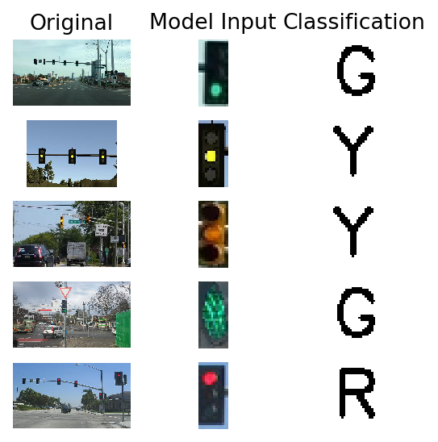

## Team Members

Markus Glau (Team Lead) - glaumarkus1209@gmail.com

[Bogdan Kovalchuk](https://github.com/bogdan-kovalchuk) - bogdan.kovalchuk@globallogic.com

Jorve Kohls - jorve.kohls@tuhh.de

[Chitra Chaudhari](https://github.com/ChitraChaudhari) - chitraksonawane@gmail.com

Nihar Patel - patel.nihar2596@gmail.com


# Project overview

This is the project repo for the final project of the Udacity Self-Driving Car Nanodegree: Programming a Real Self-Driving Car. For this project, we had to write ROS nodes to implement core functionality of the autonomous vehicle system, including traffic light detection, control, and waypoint following! You will test your code using a [Udacity Simulator]. As eplained in the walkthrough we divided the project in te following parts,
- Waypoint updater
- Drive By Wire node
- Traffic light detection

Test runs with the vehicle have been completed with both 1.2 and 1.3 simulator, as well as testing the traffic light detection and classification with provided traffic light bag.

### Waypoint updater

The waypoint updater is responsible for processing map data to return a path the vehicle can follow along the road. It is crucial that the vehicle doesnt start moving before all nodes have been initialized. Since the traffic light detection module uses tensorflow and takes some time to be initialized, the car will print warnings if it observes current locations coming in but no image data. If everything has been initialized, the car will start to generate a lane and its corresponding waypoints based on the map waypoints. The waypoint updater also subsribes to the traffic light detection and decelerates if there is an identified stop line for an intersection. 

### Drive By Wire node

Carla is equipped with Drive by Wire (DBW) technology, which makes possible controlling the throttle, steering and brakes electronically.
In particular, the DBW Node (in dbw_node.py) is resposible handling all the communications. It's subscribed to the current_vel,twist_cmd and dbw_enabled topics and it publishes the throttle_cmd, brake_cmd and steering_cmd topics.
Steering targets are generated by the YawController class inside yaw_controller.py, while Throttle and Brake commands use separate PID controllers found in pid.py.
The actual controls are implemented in the twist_controller.py file. In the current implementation is that brake and throttle commands are generated and published in separate branches of a conditional statement and reset when a competing signal is sent to the DWB node, and as such are not allowed to interfere with one another and allowing smoother transitions between one or the other.Throttle is controled by control algorithm (ref: https://ijssst.info/Vol-17/No-30/paper19.pdf).The positive value that returns this algorithm are the throttle values of the car.Then we smooth the final values of throttle. 
When the algorithm returns a negative value for throttle, it means the car needs to decelerate. Brake is the amount of torque that is applied to the brake system to decrease the car's speed. As we did for throttle, we smooth the final values of brake for the comfort .

### Traffic light detection

Carla publishes image data from a camera attached at the front of the vehicle. Therefore a node is needed, that one the one hand detects traffic light boundaries and on the other classify the colors of the given light. 

For the detection task it's best to refer to already trained models. Well suited for this task are the object detection models in the [Tensorflow detection model zoo](https://github.com/tensorflow/models/blob/master/research/object_detection/g3doc/detection_model_zoo.md). 

These models are pre-trained on the [COCO
dataset](http://mscoco.org), the [Kitti dataset](http://www.cvlibs.net/datasets/kitti/),
the [Open Images dataset](https://github.com/openimages/dataset), the
[AVA v2.1 dataset](https://research.google.com/ava/) and the
[iNaturalist Species Detection Dataset](https://github.com/visipedia/inat_comp/blob/master/2017/README.md#bounding-boxes) and already feature a label for traffic lights (10). Therefore any of these models could be used out of the box. 

Since the target project is within an embedded system, speed will matter. Considering this, I used the ssd_mobilenet_v1_coco, which on reference has the fastest performance with the given tensorflow distribution. First I initilize the tl_detection with the already existing frozen inference graph and link the input and output tensors of the graph with class variables. The input tensor in this graph is an image of any size. The outputs are then boxes around the object, score (certainty) and the corresponding class. The outputs are ordered by score, which means high certainty is also high up on the list. I implemented a filter on the score to be at least above 0.5 certainty.

For classification task a basic CNN architecture is used to classify the resulting images. This model was created by using the [BOSCH Dataset](https://hci.iwr.uni-heidelberg.de/node/6132), which features around 5000 consecutive images of driving and already labeled and detected traffic light boxes. Around 3600 images were extracted from the labeled boxes and after sampleing used to train the network. In a fully integrated pipeline, the detection and classification take around 0.06s on average and could therefore reach a performance of 10 FPS. More details an model creation and performance can be found within the respective [repo](https://github.com/glaumarkus/Traffic-Light-Detection-and-Classification).



## Challenges

We noticed that the provided udacity workspace is not perfectly suited for running the simulator, due to some lag which cause the vehicles dbw node to get out of sync with the vehicle. This will result in it leaving the road. Various optimization attempts to reduce latency with limiting the amount of processed images or reducing the run frequency of waypoint updater yielded not much success. The same code however run fine with using the provided VM image from udacity and running the simulator on the host. 

As the project setups is tested against the udacity simulator 1.3 but evaluated against the 1.2 version, we also did test runs on the old simulator. Here the frequency in which the traffic lights change color is much higher, which may lead to some odd situations: the car stops correctly at the identified line but fails to accelerate quick enough to pass the traffic light during the green cycle. Some adjustments have therefore been made to enable quicker acceleration.

# Setup

Please use **one** of the two installation options, either native **or** docker installation.

### Native Installation

* Be sure that your workstation is running Ubuntu 16.04 Xenial Xerus or Ubuntu 14.04 Trusty Tahir. [Ubuntu downloads can be found here](https://www.ubuntu.com/download/desktop).
* If using a Virtual Machine to install Ubuntu, use the following configuration as minimum:
  * 2 CPU
  * 2 GB system memory
  * 25 GB of free hard drive space

  The Udacity provided virtual machine has ROS and Dataspeed DBW already installed, so you can skip the next two steps if you are using this.

* Follow these instructions to install ROS
  * [ROS Kinetic](http://wiki.ros.org/kinetic/Installation/Ubuntu) if you have Ubuntu 16.04.
  * [ROS Indigo](http://wiki.ros.org/indigo/Installation/Ubuntu) if you have Ubuntu 14.04.
* [Dataspeed DBW](https://bitbucket.org/DataspeedInc/dbw_mkz_ros)
  * Use this option to install the SDK on a workstation that already has ROS installed: [One Line SDK Install (binary)](https://bitbucket.org/DataspeedInc/dbw_mkz_ros/src/81e63fcc335d7b64139d7482017d6a97b405e250/ROS_SETUP.md?fileviewer=file-view-default)
* Download the [Udacity Simulator](https://github.com/udacity/CarND-Capstone/releases).

### Docker Installation
[Install Docker](https://docs.docker.com/engine/installation/)

Build the docker container
```bash
docker build . -t capstone
```

Run the docker file
```bash
docker run -p 4567:4567 -v $PWD:/capstone -v /tmp/log:/root/.ros/ --rm -it capstone
```

### Port Forwarding
To set up port forwarding, please refer to the "uWebSocketIO Starter Guide" found in the classroom (see Extended Kalman Filter Project lesson).

### Usage

1. Clone the project repository
```bash
git clone https://github.com/udacity/CarND-Capstone.git
```

2. Install python dependencies
```bash
cd CarND-Capstone
pip install -r requirements.txt
```
3. Make and run styx
```bash
cd ros
catkin_make
source devel/setup.sh
roslaunch launch/styx.launch
```
4. Run the simulator

### Real world testing
1. Download [training bag](https://s3-us-west-1.amazonaws.com/udacity-selfdrivingcar/traffic_light_bag_file.zip) that was recorded on the Udacity self-driving car.
2. Unzip the file
```bash
unzip traffic_light_bag_file.zip
```
3. Play the bag file
```bash
rosbag play -l traffic_light_bag_file/traffic_light_training.bag
```
4. Launch your project in site mode
```bash
cd CarND-Capstone/ros
roslaunch launch/site.launch
```
5. Confirm that traffic light detection works on real life images

### Other library/driver information
Outside of `requirements.txt`, here is information on other driver/library versions used in the simulator and Carla:

Specific to these libraries, the simulator grader and Carla use the following:

|        | Simulator | Carla  |
| :-----------: |:-------------:| :-----:|
| Nvidia driver | 384.130 | 384.130 |
| CUDA | 8.0.61 | 8.0.61 |
| cuDNN | 6.0.21 | 6.0.21 |
| TensorRT | N/A | N/A |
| OpenCV | 3.2.0-dev | 2.4.8 |
| OpenMP | N/A | N/A |

